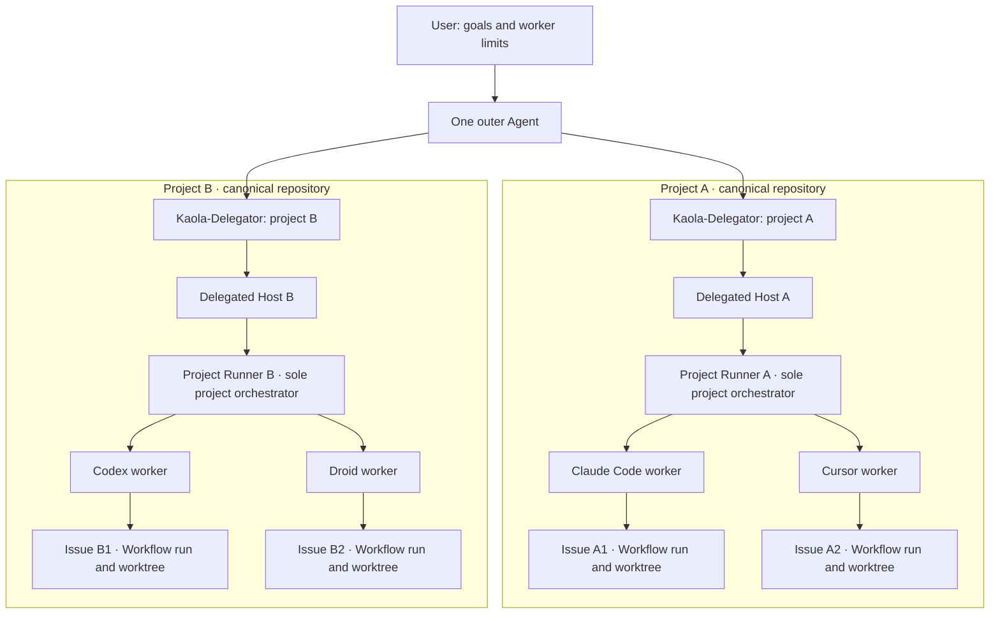

# Kaola Project Runner

**Let one agent work through another agent's CLI.**

One outer Agent can coordinate **multiple projects at once**. With Kaola-Delegator, each
project gets its **own delegated Host** running **one Project Runner Agent**; that Runner
assigns the project's authorized workers to separate issues. Each worker can use Kaola
Workflow to autonomously advance its issue, verify the result, and report back. Project
records and worktrees stay within that project's canonical repository; workers and
authorization are not pooled across projects.



This is the **hands-off** path, not a mandatory chain: you can instead load Project Runner
directly for one project's orchestration, use a Platform Runner to coordinate one or a few
issues yourself, or use Workflow Next in the current Agent for one issue. A worker's result
returns to its project's Runner for review and close-out; the outer Agent supervises the
project-level delegation, not each inner worker.

Pick the most direct entry for how much you want to control. Do not force every task through
every layer. Each layer finishes its own job and does not repeat the next.

| If you want | Use | What it does | What it does not do |
|---|---|---|---|
| Hands-off: delegate the whole project | **Kaola-Delegator** (`kaola-delegator`) | Extract goal, progress, authorized platforms/quota/priority, and stop boundary; start or resume **one** delegated Host that must load Project Runner | Dispatch workers, copy a mission ledger, maintain the inner heartbeat, or bind per-worker variables |
| Control the orchestration | **Project Runner** (`kaola-project-runner`) | Recover authorization, plan, dispatch, heartbeat, accept before finalize, and own close-out | Run as a second orchestrator on the same project |
| Coordinate one or a few issues yourself | **Platform Runner** (`<platform>-kaola-project-runner`) | Exact-session start, send, read, and stop | Task planning or completion judgment |
| Do one issue in this Agent | **Workflow Next** | Claim or resume that issue and advance it | Finalize, archive, and sink — those are Workflow finalize |

**Status.** Kaola-Delegator is included in this repository and the v0.4.0 release; installation
on any particular machine still requires verification. The current Host adapter uses
**ZCode ACP**; the delegation and project-control layers are not tied to that backend.
Grok Bot account-side live UAT has not been run. Ten Platform Runners and Project Runner
remain the communication and control-plane Skills.

**One project, one Project Runner Agent.** Several workers on one project are not several
orchestrators, and several issues are not a bundle. Start and stop use the bound canonical
project root and an exact session. Do not add a registry, lock, or second scheduler.

**When the outer Agent changes (A→B).** B recovers the same live Host from the canonical Git
root plus the standard Runner session (`zcode-<PROJECT>-orchestrator-main`) and existing Runner
`status` / receipts — not from A's chat memory and not from a Delegator pointer file. A Git
worktree is not an ACP id. Three facts stay separate on those receipts: Runner `--session`,
ACP `acp_session_id`, and native `sess_*`. Never synthesize one from another. A live Host is
attached in place; a uniquely recorded nonstandard live name is adopted. Ambiguous location
does not start a second Host. One live Host per canonical root (Issue #132): a second
Host-named `start` refuses `host-exists` and names the `existing_host` that holds the root — to
attach when it verifies, to exact-stop and prove gone when it is dead or silent, and to report
for a human when it answers under another instance (`mismatch`); only a dead or reused holder PID
leaves the root free.
"Live" is an identity check — record present, holder PID alive, admin socket answering, and the
socket's `holder_instance_id` equal to the record's; a PID alone is never liveness. A Host that
fails the check is exact-stopped with its recorded `holder_instance_id` and proven gone
(`status` reads `stopped` with `residual_pids: []`, or `no-session`) before a new one starts.
Every Delegator reach-out prompt carries a `sweep=` line: the Host lists this repo's holders
(`kaola-acp list --repo ROOT --include-dead`), stops only orphans, keeps in-flight seats, and
reports one `swept:` line. If the Host is confirmed stopped and `sess_*` cannot restore,
start a new standard-named Host as a new ACP session only after current authorization is
complete (goal, remaining work, platforms/members, counts/concurrency, quota, priority,
delivery/stop boundary); missing key values: ask, do not `start`, do not guess a stale
quota. Quota travels in the units the user actually gave: a unit the user never gave is
carried as unspecified and does not block the start, not as unlimited and not as a
fourth question; a unit whose meaning is unclear is ambiguous, so ask. Continue from
Git / Workflow / Issue records. Changing the outer Agent does not
stop a live Host or re-claim issues. Grok Bot, after the account bridge, attests each Host
`status`/`start`/`resume`/`send`/`stop` on that bound target with the existing locator
`--project` `--worker zcode` `--session` (the exact live name); Codex and generic do not.

Kaola Project Runner also provides ten self-contained **worker** Agent Skills for **Claude Code,
Codex CLI, Cursor CLI, Devin CLI, Grok CLI, Kimi CLI, OpenCode, ZCode, Droid CLI, and dsh
(DeepSeek Harness)**. A
controlling agent can start a session in a Git repository, send instructions, read replies and
runtime evidence, and stop that exact owned session. Communication uses structured ACP (Agent
Client Protocol) only. Pair a chosen entry with
[Kaola Workflow](https://github.com/KaolaBrother/Kaola-Workflow) when that work needs a
recoverable path from issue to verified delivery.

## Agent runtime support

There are two independent choices: **which agent loads the Skill**, and **which CLI it drives**.
For example, Claude Code can load the Codex Runner Skill to work through Codex CLI.

### Target CLIs

Each target has its own generated **worker** Skill, platform manifest, and launch adapter.
The main orchestrator Skill is generated separately and is not an eleventh platform.

| Target runtime | Skill | CLI executable |
|---|---|---|
| Claude Code | `claude-code-kaola-project-runner` | `claude` |
| Codex CLI | `codex-kaola-project-runner` | `codex` |
| Cursor CLI | `cursor-cli-kaola-project-runner` | `cursor-agent` |
| Devin CLI | `devin-kaola-project-runner` | `devin` |
| Grok CLI | `grok-kaola-project-runner` | `grok` |
| Kimi CLI | `kimi-cli-kaola-project-runner` | `kimi` |
| OpenCode | `opencode-kaola-project-runner` | `opencode` |
| ZCode | `zcode-kaola-project-runner` | explicit `KAOLA_ZCODE_ENTRY` + `KAOLA_ZCODE_NODE` |
| Droid CLI | `droid-kaola-project-runner` | `droid` |
| dsh (DeepSeek Harness) | `dsh-kaola-project-runner` | `dsh` |

Droid is driven through its native ACP agent command, `droid exec --output-format acp`, with
Auto Model and full bypass defaults. Login is a human act in a native terminal, outside the
Runner (TUI `/login` or `FACTORY_API_KEY`).

dsh is driven through its shipped automation-only ACP profile, `dsh --profile acp`. It needs no
login (`authMethods` is empty), resumes with `session/resume` rather than `session/load`, and has
no `--continue`: `session/list` carries no timestamp to order candidates by. dsh ships no terminal
UI — its profile templates are `acp`, `headless`, `sdk`, `sdk-minimal` and `web`.

Three facts an operator should know before the first dispatch. **dsh runs with full access by
default.** Its ACP composition never sends a permission request; its permission mode is the launch
variable `DSH_PERMISSION_MODE`, and the Runner starts dsh with `danger-full-access` (no Seatbelt
sandbox, approval `never`), the same full-access default as every other platform's measured bypass.
A caller that wants the sandbox sets `DSH_PERMISSION_MODE` or passes `--mode` (`read-only`,
`workspace-write`, `danger-full-access`); either wins. Under dsh's own default `workspace-write`,
shell writes outside the workspace, `/tmp` and `$TMPDIR` are denied, and a Runner start run from
that shell inherits the sandbox, so a nested dsh worker cannot boot (Issue #120). The Issue #98
outside-workspace probe wrote to `/tmp`, which is inside that writable set. **A ready session can
still be unable to answer.** The shipped profile pins the `deepseek-official` route and ignores the
user's own default-model setting, so `start` reports `ready` and the first prompt fails with
`no API key for provider route "deepseek-official"` — supply `DEEPSEEK_API_KEY` or pass `--model`
to select a credentialed route. **The profile must already exist** under `$DSH_HOME`; creating one
writes there, which the Runner never does.

Every platform communicates over ACP only, with structured replies and events; capabilities vary
by platform. The PTY transport is retired (Issue #130): any command given `--transport pty` is
refused with `transport-pty-retired` and `mutation_performed: false` before anything exists, and
login is a human act in a native terminal, outside the Runner. Claude Code's ACP agent is a vendored, pinned fork of
[harukitosa/claude-code-acp](https://github.com/harukitosa/claude-code-acp) (MIT,
`vendor/claude-code-acp/`, upstream commit `6c20f2802e390c80b0542247c6b9738e11efdc11`) shipped
inside the Claude Code worker Skill and run from there with the local `node`: it drives the exact
`claude` binary (`CLAUDE_BIN`, else the first PATH match, resolved by the Runner and passed as an
absolute path) as one `claude -p` subprocess per turn under the user's claude.ai subscription and
native Settings. The Runner never references the npm registry package of the same name, never
runs `npx`, and never reads, copies, or logs Settings, proxy values, or credentials; the bridge
drops `ANTHROPIC_API_KEY`/`ANTHROPIC_AUTH_TOKEN` from the child environment. ACP became Claude
Code's default after the live subscription gate of Issue #50 passed on this Mac (2026-09-16:
Fable High sentinel, native transcript model `claude-fable-5-1`, tool call, cancel, continue,
resume, zero residue, Settings untouched); login is a human act in a native terminal, outside
the Runner. Under this bridge `permit` settles only the reported
`tool_call` status: the `claude -p` child has no stdin and no `--permission-prompt-tool`, so a
permission answer cannot gate or resume the child, and on 2.1.272 a Bash tool call emitted no
`permission_request` in `bypassPermissions` or `manual` mode. Because each `claude -p` runs
detached in its own process group, the bridge appends each child's pid, group, and spawn time to
the holder-named `children.jsonl` at spawn and the holder also notes those groups from the process
tree while the bridge is alive; `stop` sweeps whichever is still alive under that identity
(`swept_child_pgids`), including after the bridge died before forwarding a single line. The bridge keeps its own map of ACP sessions to native
Claude session ids in `~/.claude-code-acp/sessions.json` (override with `CLAUDE_ACP_STATE_DIR`);
that file is what `start --continue` reads, it holds ids and cwd paths only, and rollback may
delete it. ZCode's ACP agent is the Runner-owned translator `scripts/kaola-zcode-acp.py`,
shipped only inside the ZCode worker Skill and resolved from `$SKILL_DIR/scripts/`. It talks
ACP to the Runner and the installed ZCode `app-server --stdio` protocol to an explicit
absolute `KAOLA_ZCODE_ENTRY` plus `KAOLA_ZCODE_NODE` (never PATH, never npm). Login stays
inside the ZCode App; the adapter's child environment is an allowlist, so `ANTHROPIC_API_KEY`
and other billing levers are not forwarded. Because headless CLI 0.16.5 cannot see the desktop
login, the adapter reads the App's provider registry (`~/.zcode/v2/config.json`) read-only,
selects the enabled GLM Coding Plan provider (Start Plan and pay-as-you-go providers are
refused, never fallen back to) and hands it to the app-server in memory, the same mechanism the
desktop App uses; nothing is written under `~/.zcode`, and the credential never reaches receipts
or logs. Which in-memory mechanism applies depends on the installed app-server, and the CLI
version string cannot tell them apart (0.16.5 ships with both), so the adapter picks by the
backend's own error rather than a version gate: a pre-3.12 app-server takes the `runtimeModel`
overlay, while ZCode 3.12+ dropped `runtimeModel` entirely and instead needs the bundled provider
table located next to the verified entry (the shipped 3.12.x entry cannot find its own), the plan
registered through `provider/updateAccountConfig`, the model selected on the `account:*` provider
through `session/setModel`, and the credential supplied per model request through
`interaction/requestProviderRuntimeHeaders`, which also requires an explicit `options.reasoningLevel`
on selection. Default transport is ACP. Two live Coding Plan gates have passed, each against the
desktop build named: **3.11.2** on 2026-09-16 (the `runtimeModel` path), and **3.12.3** on
2026-09-19 (the account-provider path — start with mode `yolo` applied, explicit selection on
`account:bigmodel-individual-coding-plan`/`GLM-5.3`, a real model reply, then exact stop reporting
no residual process). Neither receipt carries over to a build it was not run against, and both were
taken on one macOS machine with the ZCode desktop App already logged in; a different desktop
version, plan, or machine is unverified until it is run there. The bundled ZCode runtime ships no
terminal UI (`Cannot find package '@zcode/tui'`), and login happens in the ZCode desktop App.

### Main orchestrator Skill

`kaola-project-runner` (display name Project Runner) is a control-plane Skill for a host Agent
that already has explicit CLI authorization. It recovers live work, dispatches through the ten
worker Skills, reviews evidence before finalize, and keeps close-out ownership after a session
stops. Prefer the selected authorized Workflow sync/merge when a PR is not required; a PR
is not opened merely for handoff when that sink is suitable. If PRs exist, advance actionable
ones first on contested capacity while other authorized work continues in parallel across
permitted CLIs. The authorized count is a hard cap on live worker processes, ACP holders
included: stop-before-start at the cap, stop each seat once its delivery is accepted, and give a
new task a new session; idle is not keep-alive. Ending a run defaults to finishing in-hand issues and a clean workspace. A stated
stop boundary blocks new tasks and new issues without dropping in-hand work. Only an explicit
"stop here, continue later" pauses that cleanup and preserves recovery. It does not add a
platform manifest, transport adapter, scheduler, or backlog mirror. Heartbeat and completion
policy live here; worker Skills stay transport-only. `templates/grok-golden/` remains frozen
historical evidence, not this Skill's contract.

### Agents that load the Skills

The installer provides native skill-directory destinations for **Codex, Claude Code,
Cursor, Devin, and ZCode** (`--runtime zcode` → `~/.zcode/skills`; a workspace
`.zcode/skills` or `.agents/skills` works through `--skills-dir` — see
[ZCode host](docs/zcode-host.md);
for Codex's user-level and project-level `SessionStart(compact)` recovery hooks see
[Codex host](docs/codex-host.md)).
**Grok Bot** is a **bridge host** for **Kaola-Delegator**, not a Project Runner
host. Its generated account Skill is included in this release, but account-side live UAT is
not yet verified. The account
holds exactly one very small generated Skill,
`hosts/grok-bot/kaola-delegator.md` (≈ 2 KB), that binds an
execution target first (Local Computer, or the cloud Agent Computer), asks that target's
device-local locator `kaola-project-runner-locate` for the verified `kaola-project-runner`
checkout (expected origin, accepted pinned revision, clean tree), and loads only
`ROOT/skills/kaola-delegator`. That Skill starts or resumes one ZCode Host, which
loads Project Runner internally. The bridge carries no policy, transport, reference, path, runtime copy, or
credential; a release changes only its accepted-revision line, and an accepted content/pin
pair is never rebased or squashed. Nothing on one target reaches
the other, and the cloud never installs or updates the Mac. Grok Bot is a packaging adapter
inside the renderer, not a transport platform; still ten worker platforms, and `--platform grok`
remains the Grok CLI worker. Research on Grok Bot 0.51.0 found `NO_SUPPORTED_PATH` for
automated account-Skill creation, so one native skill write is the only account operation and
the owner's read-only Local Computer UAT is the live boundary — this repository does not claim
live Grok Bot adoption. See
[Grok Bot host](docs/grok-bot-host.md). The bridge is delivered as two commits (content commit R,
then pin commit P that names R; the bridge is saved from P and every target is checked out clean
and detached at R). Progressive disclosure is a locked invariant on every
host (see [conventions](docs/conventions.md#progressive-disclosure)). Other hosts can use `--skills-dir /absolute/path`
if they can load `SKILL.md` and execute shell commands in an environment with the
required tools. Codex and generic `--skills-dir` destinations also install
`kaola-delegator` next to Project Runner.

These are portable Agent Skills, with no dependency on a Codex installation. This does not mean
every host/target combination has been tested. Recorded end-to-end host coverage includes Codex
and Devin; see [validation and evidence](#validation-and-evidence) for the limits.

## What Runner does

- Start, inspect, and stop an exact session associated with a repository and target CLI.
- Send agent-selected prompts; `key escape` maps to ACP cancel, and there is no native key,
  menu, or editor transfer.
- Return replies, tool events, terminal output, process facts, and transport receipts.
- Apply per-run model and effort choices, with platform presets and explicit overrides.
- Resume native conversations where supported, or let the agent choose a fresh session.
- Expose ACP sessions for human inspection through `list`, `view`, and `follow`.

The controlling agent chooses the task, interprets the output, and decides what to do next.
Runner reports runtime and model observations as evidence. A successful send or a finished reply
alone does not establish that the task is complete. Worker Skills do not automatically retry
prompts, upgrade models, or schedule recurring work. Project-level heartbeat
and acceptance belong to the main orchestrator Skill when that Skill is in use.

## Collaborative delivery with Kaola Workflow

[**Kaola Workflow**](https://github.com/KaolaBrother/Kaola-Workflow) provides the engineering
workflow: issue claims, a recoverable mission ledger, validation, finalization, and delivery records.
Runner provides the communication channel through which an agent asks another runtime to do that
work. Both can be used independently.

```text
Host Agent
  └─ Main Skill kaola-project-runner (optional control plane)
        └─ Worker Runner Skill → ACP → Target CLI
                                      └─ Kaola Workflow
                                                  Issue → Claim → Mission ledger → Work & validation
                                                        → Finalize → Archive & sink
```

A typical collaboration works like this:

1. Install Runner for the controlling agent and
   [install Kaola Workflow](https://github.com/KaolaBrother/Kaola-Workflow/blob/main/docs/installation.md)
   for the target runtime. Workflow must be available to the CLI doing the work.
2. Inspect current Git and Workflow evidence, then start an owned session with `--repo` bound to
   the consuming project's **canonical project root** (the main checkout, not a Workflow child
   worktree).
3. Send the task and ask that CLI's main conversation to start or resume with `workflow-next`,
   following that runtime's installed Workflow instructions. The worker's Workflow then creates,
   resumes, or recovers its own run, branch, mission ledger, and child worktree. One run
   claims one real issue; a second issue means a second run, session, and name.
4. The CLI performs the work and validates the result. The controlling agent reads replies and
   work evidence, then sends follow-up instructions as needed. Keep `kaola-workflow-finalize` in
   the worker conversation; the outer agent verifies evidence before directing it.
5. After acceptance, the agent supervises `kaola-workflow-finalize` and verifies the selected PR
   or merge/sync outcome, archive, and sink. It stops the owned Runner session when further
   interaction is no longer needed.

Several exact Runner sessions may share one canonical project root while their Workflows own
distinct child worktrees. Linked-worktree starts, outer-created branches, and existing-run
recovery are Agent decisions, not transport gates.

Every new issue-backed ACP dispatch picks its real open issue first and names the session
`<platform>-<PROJECT>-i<ISSUE>-<unique-purpose>` (`droid-KT-i274-parser`), where `PROJECT` is
the short code the consuming project's heartbeat declares beside its canonical repository
identity. Several workers may share one issue's run and mission ledger under distinct names and
distinct native sessions. The ledger is `kaola-workflow/.ledger/issue-<N>.jsonl` in the canonical
root, one `{n,name,details,status}` line per mission; Workflow is its only writer, the Host reads
`done` lines over total read-only, and an absent file means `unknown`. This is control-plane scheduling policy in the main Skill
(`references/issue-dispatch.md`), not a transport gate: the `--session` syntax is unchanged, a
running session is never renamed or restarted to adopt it, and a name never overrides the
repository identity and claimed `issue_number` it is checked against.

### Normal path

Start Claude Code with `--repo /path/to/project` at the canonical project root. Ask that
conversation to invoke `workflow-next` for issue #52. Workflow claims the issue and creates or
resumes its chosen child worktree. The Runner session remains the root-started exact session.

### Orchestrator binding

A Project Runner Orchestrator states that root once instead of re-proving it on every dispatch:

```bash
export KAOLA_PROJECT_RUNNER_CANONICAL_REPO=/path/to/project
```

While it is exported, `--repo` may be omitted and is completed from that root, and a `start` that
names a different root - a linked worktree of the same repository included - is refused with
`canonical-root-mismatch` and `mutation_performed: false` before any process, holder or
record exists; an accepted dispatch reports `canonical_repo` in its receipt. Commands on a session
that already exists keep the `--repo` they were given, so earlier work stays observable and exactly
stoppable by its own locator. Without that export nothing changes.

### Evidence-backed exception

If a live run already exists and an earlier session was started inside a child worktree, the
controlling Agent may stop it and restart at the canonical project root, or continue there for
review or recovery. Report the chosen Git root. The transport did not refuse the linked worktree.

A session already running in a child worktree is advisory: preserve work, inspect state, then
continue, stop/restart at root, or use another Workflow recovery path.

This combination gives you:

- **Cross-runtime collaboration:** choose an appropriate CLI while keeping the task's engineering
  process consistent. Each CLI retains its own tools, model options, and native behavior.
- **Recoverable work:** Workflow's claim, mission ledger, and results let an agent reconcile progress
  after an interruption. Runner can reconnect to a supported native conversation or start another
  session that reads those records; recovery remains an agent decision.
- **Verifiable handoffs:** replies show what the CLI says; repository changes, validation evidence,
  and forge state establish what it delivered. A delivered PR is distinct from a merged change.

All ten worker Skills include this optional Workflow guidance. Starting a worker Skill alone does
not install Workflow, claim an issue, send `workflow-next`, or create a heartbeat. The main
orchestrator Skill may register a host heartbeat after an authorized CLI allowlist exists. Runtime
coverage is also independent: Workflow's support for a runtime does not imply a Runner adapter
exists for it.

Example instruction to an agent with the Claude Code Runner Skill loaded:

> Use Claude Code to work on issue #42 in this repository. Start the owned session at the
> canonical project root. If Kaola Workflow is available there, follow its workflow-next
> instructions so that runtime owns the child worktree, inspect the implementation and
> validation evidence, and supervise workflow finalization through PR delivery. Stop the
> owned session when finished.

## Install

Requirements: Bash, Python 3, Git, and the selected target CLI with working authentication. The
ACP transport does not use tmux; only the locator's `session.present` probe reads a tmux server
when one is installed.
ACP wrappers may also require Node.js/npx; exact commands are in the [platform manifests](platforms/).
Runner does not install the target CLIs or provide model access.

```bash
git clone https://github.com/KaolaBrother/kaola-project-runner.git
cd kaola-project-runner
./scripts/render-skills.py --check
./scripts/install-local.sh
```

The default installs all ten worker Skills plus the main orchestrator Skill into
`${CODEX_HOME:-$HOME/.codex}/skills` as standalone copies. Use `--method link` to symlink
Skills to this checkout for Project Runner development. Select another host, a worker
subset, or skip the orchestrator:

```bash
# Install all worker Skills plus the orchestrator for Claude Code, Cursor, or Devin.
./scripts/install-local.sh --runtime claude-code
./scripts/install-local.sh --runtime cursor
./scripts/install-local.sh --runtime devin

# ZCode is both a worker platform and a native skill-directory Host:
# --runtime zcode installs to ~/.zcode/skills; a workspace .zcode/skills or
# .agents/skills destination (both live-verified default roots) goes through
# --skills-dir.
./scripts/install-local.sh --runtime zcode
./scripts/install-local.sh --skills-dir "$PWD/.zcode/skills"

# Issue #119: measured Skill roots of the other Host-capable CLIs (entry lines:
# skills/kaola-project-runner/references/host-entry-matrix.md; evidence:
# docs/host-entry-evidence.md).
./scripts/install-local.sh --runtime grok-cli   # ~/.grok/skills
./scripts/install-local.sh --runtime droid      # ~/.factory/skills
./scripts/install-local.sh --runtime opencode   # ~/.config/opencode/skills
./scripts/install-local.sh --runtime kimi-cli   # ~/.agents/skills (shared with --runtime dsh)

# Grok Bot: no installer destination. Save hosts/grok-bot/kaola-delegator.md (the bridge) on
# the account once, then register the device-local locator on each execution target:
python3 scripts/kaola-locate.py register --target local --bin-dir <dir on PATH> --expect-revision <accepted commit>   # validates origin/revision/clean, links kaola-project-runner-locate, writes the registration receipt beside it
kaola-project-runner-locate --target local --expect-revision <accepted commit>   # bounded attestation receipt; the locator compares host fingerprint and target with its receipt
# an --expect-revision older than the registered one is refused (expect-revision-superseded / accepted-revision-superseded); roll back by removing the receipt, then register
# With --project --worker zcode --session the receipt adds session.acp_holder_alive (the holder record kaola-acp status reads); for an ACP Host, session.present is tmux-only and never aliveness on its own.

# Let Claude Code drive only Codex CLI and OpenCode; still install the orchestrator.
./scripts/install-local.sh --runtime claude-code --platform codex,opencode

# Workers only (no main Skill).
./scripts/install-local.sh --runtime cursor --no-orchestrator

# Explicit destination; copy is the default, so --method copy is optional.
./scripts/install-local.sh --skills-dir "$PWD/.agent/skills"

# Maintainer development: symlink Skills to this checkout.
./scripts/install-local.sh --method link
```

`--runtime` selects the host's skill directory; `--platform` selects worker CLI Skills only.
`--no-orchestrator` skips `kaola-project-runner`. That name is not a `--platform` id.
On Codex and generic destinations, `kaola-delegator` is control-plane: a first
install still needs `zcode` in this `--platform` (or no `--platform`); an
already-installed Delegator is included on later reinstall/uninstall even when
this `--platform` omits `zcode`, so a filtered pass does not leave a stale copy.
The Codex destination (`--runtime codex`, or no destination flag) also installs one
Runner-owned user-level `SessionStart(compact)` recovery entry in
`${CODEX_HOME:-$HOME/.codex}/hooks.json` whenever the control-plane Skills are in the plan,
so an outer Codex Agent using `kaola-delegator` or `kaola-project-runner` re-reads that
installed Skill after a compaction from any repository; `--no-orchestrator` skips it,
`--uninstall` removes only it, and `--skills-dir` never touches a `hooks.json`. Codex still
asks you to review and trust the new entry in `/hooks`, and it loads from the next session —
see [Codex host](docs/codex-host.md).
`--runtime` and `--skills-dir` are mutually exclusive. Copies work without this checkout;
`--method link` requires it to remain in place. Reinstalling the default over an owned
source link migrates that Skill to a copy. The installer preserves foreign files and
links. A receipt-owned copy with payload drift is restored from the generated source
on reinstall; the previous copy is kept at the reported `.drift.*` path so the
controlling Agent can inspect it. Python `__pycache__` is ignored as a runtime
byproduct. Edit repo templates/manifests, not installed Skill copies; drift is a
diagnostic and does not gate Runner communication. Uninstall still refuses to
delete a modified copy.

Installed Skills are shared blocks counted by reference, so runtimes install and uninstall
independently (Issue #123). `kimi-cli` and `dsh` both use `~/.agents/skills`. Each Skill
receipt lists the runtimes that use it. When the same build is already installed, a second
runtime only records its reference (`refer`). A different build updates the one shared copy
and keeps every referrer, so every root stays on one build for the #105 check. `--uninstall`
withdraws only this runtime's reference; the Skill stays (`kept`) while another runtime still
uses it. A receipt written before this ledger counts as used by every runtime mapped to that
root, so it is never removed on a guess.

Use the host's Skill discovery mechanism, or have the agent read the installed `SKILL.md` directly.
In Codex, a Skill can be invoked as `$claude-code-kaola-project-runner`, for example.

To uninstall, repeat the same destination and worker selection with `--uninstall`. Add
`--no-orchestrator` to leave the main Skill in place. Optional `kaola-acp` helper links in
`~/.local/bin` are installed by default only for the Codex destination. Use `--bin-links`
elsewhere; removing those links requires `--uninstall --bin-links`. The links are counted the
same way, in `~/.local/bin/.kaola-project-runner-bin-links.json` (runtime and checkout). An
existing link to a usable executable, for example one from another checkout, is referenced
rather than replaced; a dangling link is still refused. Uninstall keeps a link while another
runtime or checkout still refers to it. It keeps `kaola-project-runner-locate` while the Grok
Bot locator's registration receipt sits beside it, and the installer never writes that receipt.
See the [installer reference](docs/api.md#installer) for all options.

## Direct command example

From this checkout, the shared entry point accepts a platform, operation, repository, and session:

```bash
REPO="/absolute/path/to/your/git-repository"
SESSION="opencode-example"

./scripts/kaola-tmux.sh opencode preflight --repo "$REPO" --session "$SESSION"
./scripts/kaola-tmux.sh opencode start --repo "$REPO" --session "$SESSION"
./scripts/kaola-tmux.sh opencode send --repo "$REPO" --session "$SESSION" \
  --text 'Explain this repository and summarize its test commands.'
./scripts/kaola-tmux.sh opencode observe --repo "$REPO" --session "$SESSION"
./scripts/kaola-tmux.sh opencode capture --repo "$REPO" --session "$SESSION"

# Read the reply and decide whether more interaction is needed before stopping.
./scripts/kaola-tmux.sh opencode stop --repo "$REPO" --session "$SESSION"
./scripts/kaola-tmux.sh opencode status --repo "$REPO" --session "$SESSION"
```

`steer` delivers one Agent-chosen message to a turn that is **already running**, alongside
`send`. It is an ACP-only tool, and the Agent picks the mode. Which platforms have a native
mid-turn entry is read from `native_steering` in `platforms/<id>.yaml` — `supported` means the
entry exists, `unsupported` means it was investigated and does not, and `unknown` means no probe
has settled it. No roster is pinned here, because that answer changes as surfaces are investigated:

```bash
# Native mid-turn entry, on a platform whose manifest says native_steering: supported.
./scripts/kaola-tmux.sh codex steer --repo "$REPO" --session "$SESSION" \
  --text 'Stop the current approach and do X instead.'

# The composite works on every platform and is always chosen explicitly: interrupt the
# turn, then continue the same session.
./scripts/kaola-tmux.sh droid steer --repo "$REPO" --session "$SESSION" \
  --steer-mode interrupt --text 'Stop the current approach and do X instead.'
```

The composite cancels the running turn, confirms it actually stopped, and then sends the text once
as the next turn on the same ACP session, so the conversation keeps its context. That is
interrupted-then-continued, never injection: the receipt says `interrupted_and_resent` with
`side_effects_possible`, because the interrupted turn's finished work is not undone. A platform with
no native entry refuses a bare `steer` with `steer-mode-required` rather than interrupting on its own,
and if a cancel is not confirmed nothing is sent at all. The receipt never overstates consumption —
`injected` only when the agent acknowledges it, `written` when the text was merely flushed into a
platform that acknowledges nothing, and `unknown` when it is undecided. See
[docs/api.md](docs/api.md).

Installed Skills use their own `scripts/runtime-tmux.sh` with the same operations and no platform
argument. Invoke it by absolute path; `--repo` identifies the project being worked on.

Model selection uses `--tier default|upgrade` or an explicit `--model ID` with optional
`--effort LEVEL`. Presets live in the [platform manifests](platforms/); Fast is off unless requested.
Some platforms declare one further preset under their own word — `--tier alternative` on Kimi CLI,
`--tier fable` on Devin, `--tier core` on Droid — and asking a platform for a tier it does not declare is a
typed refusal, not a quiet fallback to `default`.
Resume with `start --resume NATIVE_SESSION_ID` or `start --continue` where the runtime supports it.
Droid's default and upgrade are both Auto Model (`auto`, no effort pin); Kimi K3 Max (`kimi-k3` at
`reasoning_effort=max`) is its third tier, `--tier core`, not an upgrade. Its `-fast` catalog IDs are explicit
`--model` choices, not a separate Fast toggle.
Devin's default is SWE-2 Max (`swe-2-max`); `--tier upgrade` is the Opus 5.5 High fusion
(`fusion-claude-opus-5-5-high-sidekick-swe-2-medium`, as Devin has no pure Opus 5.5 High) and
`--tier fable` is the Fable 5.1 High fusion (`fusion-claude-fable-5-1-high-sidekick-swe-2-medium`).

**Permission defaults matter:** the default is per platform, not one guarantee across all ten.
Claude Code, Codex, Devin, Droid, Kimi and ZCode apply an advertised ACP skip-all option at start
(`mode`, or `autonomy_level` for Droid). Cursor and Grok carry only a launch flag (`--yolo`,
`--always-approve`) and advertise no ACP option; OpenCode's default ACP path has none at all. dsh
advertises none either and never sends a permission request at all; its skip-all is the launch
variable `DSH_PERMISSION_MODE=danger-full-access`, which the Runner sets unless the caller set the
variable or passed `--mode`. On any of the remaining platforms with no
verified ACP skip-all - Cursor, Grok and OpenCode today - a permission request
may still arise: it surfaces through the existing `permission_required` carrier event and is
settled with `permit`. That wake is not lost when the bound ZCode Host is temporarily away: the
worker holds the undelivered event and re-offers the same one until that Host takes it, or until
the request stops being answerable. Only a send the Host never took leaves the wake owed — it was
not listening, hung up, answered something that is not a worker-event receipt, or is an older build
with no such op; each of those can still come good when the Host comes back. A receipt that names
the exact event sent settles it, and so does a refusal the Host made knowing what it refused. A wake
that stops being owed is re-checked immediately before the bytes go out, but check, write and the
Host's own staging are three steps across two processes: a request settled after the write still
leaves the Host holding a locator for something already gone. That is why the event is only a
locator — the Host re-reads the worker's live `pending_permissions` and approves nothing from the
event itself. Neither forcing PTY nor adding a gate is the answer. Use
`--permission-mode` where supported and check the native semantics: Codex ACP's `read-only` mode
is upstream on-request approval with a workspace-write sandbox and can write workspace files; it
is not an OS sandbox, and the Runner has no path to OS-level read-only.
Droid defaults to full bypass: ACP applies `model=auto` and `autonomy_level=auto-high`.
Its `--permission-mode` values are `bypassPermissions|low|medium|high|manual`; ACP maps them to
`auto-high|auto-low|auto-medium|auto-high|normal`.
Authentication and workspace trust remain native CLI concerns.

For ACP session watching, use `kaola-acp list`, `kaola-acp PLATFORM view`, or
`kaola-acp PLATFORM follow` with the relevant repository and session arguments. To learn which
platform CLIs are installed on the host, including login-shell installs a narrow-PATH app cannot
see, use the read-only `kaola-acp survey`: it starts no agent, session, or holder. To
resolve a model to its quota package without spending a turn, use `kaola-acp packages`
and `kaola-acp model-package`; an id with no verified rule is `unmapped`. Full transport,
permission, key, recovery, and receipt details are in the [command reference](docs/api.md) and
[ACP watch guide](docs/acp-watch/README.md).

## Validation and evidence

```bash
./scripts/render-skills.py --check
./scripts/validate.sh
```

The offline suite checks generated Skills, installer behavior, shell syntax, transport contracts,
and regression cases in an isolated temporary home directory. Live validation separately exercises
start, read, send, read-back, and exact-session stop with the actual CLI and account.

The full contract suite needs a dev machine with `tmux`, bash >= 4 (`mapfile`/`BASHPID`), and
Python >= 3.10; a missing prerequisite makes the affected rows skip with a named receipt instead
of failing (#151).

Published evidence includes [historical PTY-era communication tests](docs/live-smoke-issue-9-2026-08-31.md),
[Grok and Kimi ACP experiments](docs/poc-acp-transport-2026-09-11.md), and
[Cursor, Devin, and OpenCode ACP verification](docs/acp-live-verification-2026-09-11.md), and
[Droid live verification (2026-09-17)](docs/droid-live-verification-2026-09-17.md).
These are dated results, not a guarantee for every CLI version, model, or account. The recorded
Claude tests establish prompt transport and login-error read-back, not authenticated model
execution; its ACP wrapper failed initialization in the published September 11 run.

## Development

Edit the shared [worker Skill template](templates/SKILL.md.tmpl),
[orchestrator templates](templates/orchestrator/), [platform manifests](platforms/), or
[adapters](scripts/adapters/), then run `./scripts/render-skills.py --write` and validate. Commit the
generated `skills/` output; do not edit it by hand. `templates/grok-golden/` is frozen historical
compatibility evidence, not the main orchestrator contract.

See [architecture](docs/architecture.md), [development conventions](docs/conventions.md), and
[the changelog](CHANGELOG.md).

## License and use

This project is **source-available**, not licensed under an OSI-approved open-source license.
You may view, run, and modify it for personal learning, research, evaluation, and other
non-commercial purposes.

Commercial use of this project or derivative works requires prior written permission from the
copyright holder. This includes sales, paid services, SaaS, commercial product integration, and
paid products or services built around the project. Contact the repository owner for commercial
licensing.

All rights outside this limited permission are reserved. The project is provided "as is", without
express or implied warranties.
