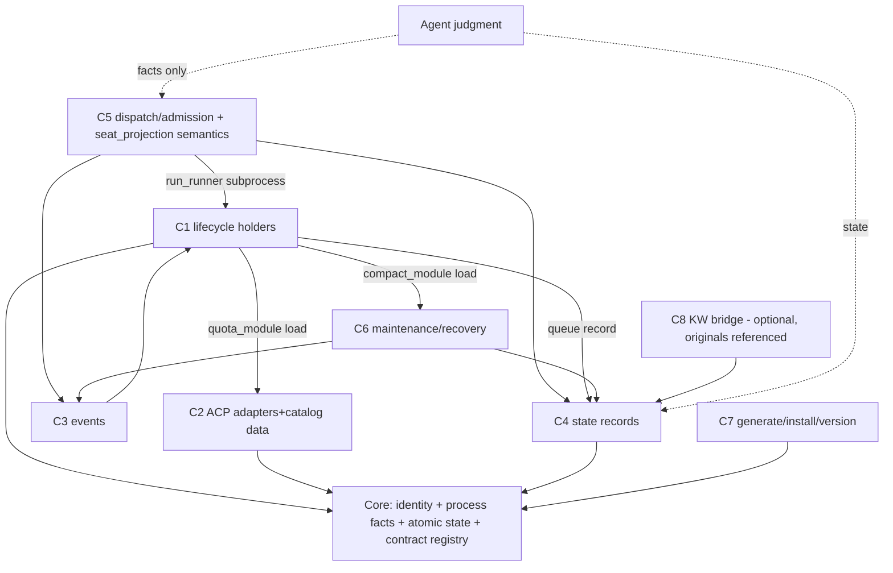
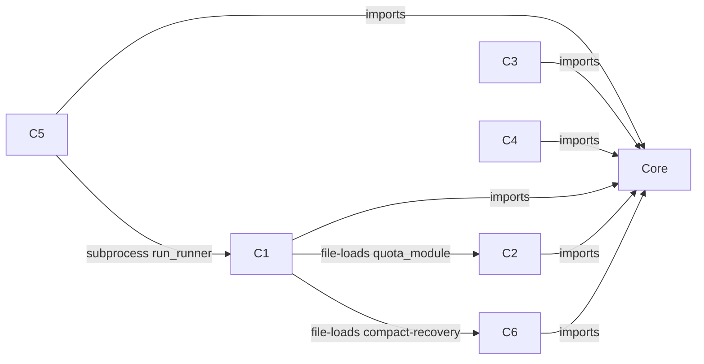
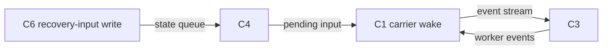

# KPR minimal core + components — formal design draft v1 (2026-10-07)

Status: REVISED DRAFT integrating ROOT'S personal technical decisions (this round) + bridge pre-review + Fable convergence v1 + addendum. Root decisions applied: Python internal package; C5 owns seat_projection semantics; KW interface = optional bridge referencing originals; pilot keeps adapters per-session; Mac supervision uses existing native service mechanisms (launchd), Linux systemd equivalently — engineering recommendations, not Owner questions; no new services created at design stage. Research corpus: docs/research/ @97551c75; Fable final + AB addendum @c61383b2; root corrections applied in place.

## 1. Current state → target

Today: ten generated platform worker Skills (transport-only), one generated orchestrator Skill (`kaola-project-runner`), one external Delegator Skill, render+install pipeline (`render-skills.py`, `install-local.sh`), per-session ACP holders + optional launchd broker, typed state tool (`kaola-dispatch.py state`), KW lifecycle scripts as a sibling repo. Monoliths (AST-measured, see inventory-appendix + recount.py): `kaola-dispatch.py` (208 top-level / 233 all), `kaola-acp-holder.py` (51 top / 209 all), `kaola-acp.py` (195 top / 207 all), `kaola-record-contract.py` (68 top / 72 all) — 721 nodes total, each spanning at least five distinct responsibilities.

Target: a **minimal core** + replaceable components. **The B-line direction is ACCEPTED: a per-user/per-machine lightweight RESIDENT core (B0, lifecycle+events first) is the target runtime form.** In staging, the core begins as a shared library so the cut is provable and the pilot has something real to host; the library is the resident core's implementation, not an alternative to it. The design must state the resident core's own runtime responsibilities and its liveness/failure boundary with holders (§6a); it does NOT default back to no-daemon. Per owner: components are cut along ACTUAL source seams (measured below), not a predecided count; no per-function microservices; dependencies are explicit contracts; subtraction (remove/replace/retire/uninstall) is a first-class operation; KPR+KW remain optional modules sharing runtime norms without forcing synchronized consumer upgrades or a central credential store.

## 2. Core (irreducible, per measured source)

What must stay together because everything else depends on it and splitting it adds contracts without removing coupling:

- **Identity model**: platform/session/holder_instance_id/native-id/repo canonicalization (`canonical`, `normalize_id`, `worker_event_id` (single owner: core; C3 consumes), `holder_of`, `assignment_identity`), plus the record-dir layout. Version IDs for the THREE KPR-owned schemas are REGISTERED BY THEIR OWNING COMPONENTS (C4: heartbeat+delegator-heartbeat; C5: dispatch-index) — core holds only the registration mechanism and the identity schemas, not permanent ownership of every project business kind.
- **Process facts**: pid/liveness/spawn-time/argv anchor/process-tree groups (`process_alive`, `libproc_ps`, `process_table`, `child_groups`, `spawn_time_matches`, `holder_argv_anchor`, `holder_identity` in kaola-acp.py). NOTE (accuracy): these perform real I/O — /proc+sysctl reads, unix-socket probes with timeouts; they are I/O-*narrow* (local kernel + one socket), not I/O-free. Locks serialize access; **authorization of the single writer is a separate rule** (§6a lease), not implied by the lock.
- **Atomic state access**: `read_state_file`/`atomic_write`/`StateLock` + `kaola-record-contract.py` allowlists. Depends on identity only.
- **Contract registry (thin, MINIMAL)**: version numbers + the identity/deterministic-access schemas ONLY. **Module-owned schemas register independently** — project business kinds (tasks/holds/alerts/decisions, dispatch items, KW artifacts) belong to their owning components, NOT permanently to core; KW is never forced to accept KPR's heartbeat schema or cross-repo sync. Shared-schema alignment targets ONE contract per shared artifact — the current dual code-tree digests (`computeCodeTreeHash` vs `computeLandableTreeDigest`) have DIFFERENT semantics (finalize gate vs landable-tree record) and are aligned to one contract with two named views, not erased into one function.

## 3. Components (cut along measured seams)

Each row: current source (function clusters with line anchors). **The auditable assignment is `inventory-matrix.json` — 721 rows SOURCE-REVIEWED (the devin pass walked all 223 holds and corrected 207 keyword rows with per-function reasons; patch + original archived as `matrix-source-review*.md/.json`; 18 rows remain explicit keep-in-place: shared receipt emitters, argparse plumbing, bootstrap spanners). `recount.py` machine-verifies per-file top/nested/all + sha256 (522/199/721).** Known reviewer arguable calls recorded, e.g. `parse_flat_yaml`->C5 (feeds catalog_from_files; C2 also defensible). Per-component CONTRACTS are §3b; the typed error/IO surfaces in §3b now carry the source-enumerated codes from the review (`matrix-source-review.md`).

| # | Component | Current source (measured) | Why not core | Key interfaces / typed errors | Deps |
|---|---|---|---|---|---|
| C1 | Session/process lifecycle | kaola-acp-holder.py: parse_dispatcher/parse_heartbeat_host/read_heartbeat_file/start_epoch/live_spawn_entries/worker_tree_groups/dispatched_worker_groups/scrub/run_probe; kaola-acp.py start/stop/status/drain-restart/rebind-host | holder orchestration policy, not identity facts | receipts (`schema_version 3`, `stopped/exit/residual_pids`), `holder-lost`, `holder-not-ready` | core identity+process facts |
| C2 | ACP transport adapters | platforms/*.yaml, scripts/adapters/*.sh, kaola-zcode-acp.py / -opencode- / -dsh-, vendor claude-code-acp | per-platform variance; catalogs are data not logic | manifest fields, `acp_mode_config_id`, per-platform quirks docs | core identity |
| C3 | Events | kaola-acp-holder.py attention_fingerprint (consuming core's worker_event_id); kaola-acp.py observe/capture/follow; events.jsonl rotations | consumers differ (Host UI vs state) | bounded capture receipts, `truncated` fields, cursor discipline | C1 |
| C4 | Current-state access | kaola-dispatch.py state CRUD (init/update/retire/view/check/migrate; 47-fn cluster incl. task/hold/alert/decision records) | record kinds evolve; core keeps only atomic access | StateRefusal codes (`conflict`, `retire-unmet`, `schema-unsupported`...), rev numbers | core atomic access |
| C5 | Dispatch/admission facts | kaola-dispatch.py execute/collect/project/delegator_seats (27-fn cluster; dispatch_links, seat_projection) | admission policy is Agent judgment over tool facts; the tool only records facts | plan schema, index schema, dispositions, `requirement-unmet`, `resource-conflict`, `shared-occupied` | C4, C3, core |
| C6 | Bounded maintenance/recovery | recovery-input/checkpoint; kaola-compact-recovery.py; kaola-project-compact-notice.py; sideagent binding+recipe | optional (absent → inputs simply queue) | recovery_input seq, checkpoint batches, `signal-unverified` | C4, C3 |
| C7 | Generation/install/versioning | render-skills.py, install-local.sh, budgets.json, accepted-revision pin, install-verify | pure build-time; absent at runtime | render receipts, budget check, pin gate, `kaola-project-runner-install-verify/1` | CORE (registry mechanism; C4/C5 schema registrations) |
| C8 | KW engineering bridge | Kaola-Workflow repo (READ-ONLY design partner): claim/finalize/sink, chain receipts | separate ownership & artifact model already | workflow-state.md, ledger, `chain-receipt.json` codeTreeHash | C4 (optional schema registration via the core mechanism; KW artifacts stay KW-owned) |

**Not components**: Agent judgment (planning/selection/acceptance) stays in Agents by definition; #267 escalation stays per-task inside C4/C5 facts.

## 3b. Per-component contracts (THIS-round formal output)

Minimal but concrete: each component names its contract artifacts (version carrier, data owner, IO surface, typed errors, independent tests, replace/uninstall). "Version" = the schema/receipt version string ALREADY in the artifact unless marked NEW.

| Component | Contract artifacts (version carrier) | Data owner | Independent tests (existing) | Replace / uninstall |
|---|---|---|---|---|
| CORE identity/atomic | record-dir layout; identity schemas; StateLock protocol (NEW version field only if lock format changes) | consuming project `.kaola/` | test-issue-273-list-identity (real entry); test-zcode-host-contract | replace = swap library file, md5 render-enforced; uninstall N/A (core) |
| C1 lifecycle | receipt `schema_version 3` + `holder_features` advertisement | runner record roots (tempdir) | test-acp-holder-continue; test-issue-50-runner-integration | replace per-skill copy; uninstall = skill removal (C7) |
| C2 adapters | platforms/*.yaml manifest fields; `acp_mode_config_id`; kaola-quota.py parse/resolution API (CODE contract) | repo platforms/ | test-progressive-disclosure; per-platform contract suites | replace manifest+adapter pair; uninstall = --platform omit |
| C3 events | events.jsonl rotation + bounded capture receipts (`truncated` fields) | record dir | test-acp-watch/follow/sweep-contract | replace handler; uninstall = no observe (degrades) |
| C4 state | `kaola-heartbeat-prompt/2` + `kaola-delegator-heartbeat/1` schemas + StateRefusal codes | consuming project `.kaola/` | test-issue-255-lifecycle-state (128); test-issue-259-record-contract | reader-fallback set (P2) then replaceable |
| C5 dispatch | `kaola-dispatch-index/1`; plan schema; typed refusals (`requirement-unmet`, `resource-conflict`, `shared-occupied`) | repo `.kaola/dispatch-index.json` | test-issue-244-dispatch; test-issue-273 consumer class | replace engine behind same index schema |
| C6 recovery | recovery_input seq/checkpoint batch envelopes; `signal-unverified` | state file (C4 namespace) | test-issue-274-package-closure; #264 suites | optional module: absent = queued (P3 contract) |
| C7 render/install | build hashes (`main-skill-build.json`); budgets.json; pin envelope; install-verify/1 | repo + installed roots | render --check; test-issue-264-validate-lane-integrity | tooling; uninstall flags exist |
| C8 KW bridge | KW's own artifacts (workflow-state/ledger/chain-receipt) — referenced, not owned | KW repo | KW's suites (their side) | optional bridge; removal = no claim lifecycle |

Failure/loading obligations, SPLIT: (a) DECIDED THIS ROUND — the B0 IPC envelope (§6b: contract_version/request_id/operation/project_ref/session_ref/expected_holder_instance_id/body + replay/conflict semantics), the three write-resource ownership table (§6a), registry adoption handshake semantics, event cursor triple and typed-gap behavior, and the manifest grammar fields; these are the contracts B0 implements against. (b) P1 WORK — per-component exhaustive error-surface enumeration and per-function implementation (the 721-node audit), which must MATCH (a) but adds detail, not new decisions.

## 4. Mermaid dependency DAG

Two SEPARATE graphs (the v1 text wrongly merged them):

**Code-dependency graph (imports/file-loads only — ACYCLIC):**

Every edge points away from core; C1-to-C2/C6 are one-way file-loads (no component file-loads back into C1); C5-to-C1 is a one-way subprocess spawn. No cycles.

**Runtime event/control feedback (deliberate, bounded — NOT a code dependency):**

That loop IS the maintenance design (bounded recovery inputs, one node per batch, settled by checkpoint); it never appears in the code-dependency graph.

## 5. Optional install / runtime loading / subtraction

- Install-time selection exists TODAY as partial flags (`--no-orchestrator`, `--platform`, link|copy) — **a `--component` grammar with `requires`/`provides` manifests is a P2 CANDIDATE, not existing**.
- Runtime loading: **CANDIDATE pilot, not existing** — C6 (absent → recovery inputs must be DURABLY recorded by C4 with a typed `unsupported/queued` receipt and dedup on reload; who records and replays is C4's contract, to be specified in P3) and C8 (Workflow on-if-available). `holder_features` is capability ADVERTISEMENT for negotiation, not a loader; the actual load/activation mechanism is part of the P2/P3 design. Nothing here claims current behavior beyond what shipped in #271/#273/#274.
- **Manifest fields (P2 grammar)**: `id`, `version`, `provides`, `requires`, `entrypoints`, `owned_resource_types`, `runtime_states`, `retire_reader`, `export_contract`. Schemas stay component-owned and REGISTERED; the core's registry carries only the base mechanism — it never hard-codes KW business kinds. A required-dependency absence makes THAT capability typed `unavailable`; unrelated capabilities proceed. Arbitrary-component-deletability is NOT claimed. Uninstall defaults to keep-data with a working read-only export; a compatible reader may outlive its component; reading never depends solely on the allowlist; data deletion needs separate explicit approval.
- **Version compatibility**: negotiate major/minor range + capability set; whether unknown OPTIONAL fields are tolerated is stated per-contract in writing (no global reject-all or accept-all). Dynamic `unsupported` is separate from startup required-capability checks. Upgrade order: readers first, then new writers; on rollback meeting newer data, degrade to read-only/export rather than rewriting.
- **Subtraction**: every component defines (a) uninstall = remove generated payload + its config namespace; (b) retire = stop loading, keep data namespace readable via core contract registry; (c) replace = same provides-contract, swapped implementation, cross-component tests must pass unchanged; (d) data ownership stays with the consuming project (`.kaola/`), never moved into a component. Deleting a module must NOT force synchronized consumer edits: consumers depend on contracts (schemas + typed errors), and contract versions are additive-with-refuse (unknown version → refuse with named id — the proven #268/#273 style). **Retired-module data readability is NOT guaranteed by schema allowlists alone**: the core registry must ship per-kind reader fallbacks — read-only last-known-contract reader, else typed `unsupported-kind` with an export path — plus an explicit retention/migration choice at retire time (keep-readable / export-then-drop). That reader-fallback set is P2 contract-doc content, not current behavior.

## 6. Failure, fencing, upgrade semantics (design, all UNTESTED until staged)

- Single-writer per artifact stays (StateLock/atomic write). Cross-store fencing: any future shared store (B-line option) requires an explicit **handoff token** (lease with epoch) — **un-handed-off fallback dual-write is forbidden** (root constraint).
- Startup contention: per resource scope — sessions by identity-guarded exact-stop; state store by lease handoff (a random holder id never implies seniority).
- Crash recovery: C1 holder exit does not lose C4 state (files+locks); C6 re-binds queued inputs; no auto-restart (Host-on-demand boundary unchanged).
- Version compat: contract registry versions; reader-older → typed refuse (never silent). Cross-version data migration staged per component with reader-before-writer rollout (Fable C6 fact: current validator already refuses unknown keys → fail-closed).
- idle-exit is a *candidate* policy for optional components only; it must not weaken the resident-service goal (owner A/B decision) nor the per-user/per-machine lightweight core direction (B0).

## 6a. Resident-core runtime responsibilities and holder boundary (B0)

The resident core (per-user/per-machine) owns ONLY: the local registry of adopted holders, event-index/subscriptions, and lifecycle REQUESTS sent to already-identified holders. ACP sessions, process trees, and session-local events remain HOLDER-owned. The core never migrates or writes Host business JSON and never proxies Agent semantic judgments. Whether a shared-write window exists today between Host-side tools and holders is an OPEN measurement question (the three write-resource classes below define the target ownership; current-source verification of every file's actual writers is P1 inventory work, not asserted here). Process identity authority = the holder handshake + OS matching; the core's cached identity entries always carry `observed_at` + the source identity, and an expired/unreachable cache entry NEVER releases a seat. This boundary is DESIGN; untested until P5 drills.

## 6b. IPC, registry adoption, and event semantics (root ruling, design)

- **Minimal IPC envelope** (every core<->holder request): `contract_version`, `request_id`, `operation`, `project_ref`, `session_ref`, `expected_holder_instance_id`, `body`. A duplicate `request_id` with the SAME body returns the original result or a named in-progress; a different body is a typed conflict. Create/stop/send and read-only each carry their own operation semantics; `request_id` is NOT an external-Git exactly-once guarantee. An older holder that does not support an operation reports `unsupported` — it is never silently restarted.
- **Registry adoption** requires a REAL handshake carrying identity/platform/native/session/repo + protocol version; a discovery record is a lead, never an adoption. The core takes a single-instance OS lock at startup; an unknown lock holder is never preempted by timeout. After a core crash releases the lock, a new core's epoch only marks the registry GENERATION — it never supersedes holder ids. Re-adoption handshakes never restart holders; the persistent registry is rebuildable. (Future shared-write fencing = the per-resource lease in §6, not this generation epoch.)
- **Event cursor** = `(source_holder, source_epoch, seq)`. Delivery is at-least-once, ordered PER SOURCE; no cross-source total order is promised. Subscribers keep their own cursors and dedup by source+seq. A rotation past the retained range returns a typed `gap` with the earliest available position; the consumer chooses snapshot re-sync — silent gap loss is forbidden. The core's aggregate sequence never impersonates a source seq; on restart the core re-pulls original holder records, and ranges no longer retained are honestly `unknown`. Authorization content never enters the new event log.
## 7. Cross-component test evidence (what proves a cut)

Each component ships its own suite plus cross-module acceptance over the REAL seams: isolated install closure; real start/adopt/send/collect/stop; core-crash with holders continuing; two-core contention; stale registry entry + unrelated PID; event replay with duplicates and gaps; component absence and retirement; version mismatch producing no wrong writes. Fixtures are minimal per affected surface — never a fixed full-gate every round. Development mode and accepted deployments keep isolated namespaces/entries (no global mutable-dev refusal). A module suite passing alone never replaces cross-module migration/retirement proof. Pilot candidates from current reality: #274 package-closure test (C7 proving C6's helper closure), #273 real-entry suites (CORE process facts through C1 CLI and C5 consumer), #271 chain (real execute→result→correlated collect→guarded reclaim).

## 8. Open decisions for root/Fable convergence

1. DECIDED (root): Python internal package. (Was: packaging language.)
2. DECIDED (root): C5 owns seat_projection semantics; core stays free of grant semantics. Open remainder: the C4/C5 interface contract text (P1).
3. C8 contract-registry co-ownership with KW maintainers.
4. Whether C7 gains a `--component` install grammar now or after the pilot.
5. Staging order (see migration.md) and the B0 resident-core pilot scope (lifecycle+events first, per Fable AB).
