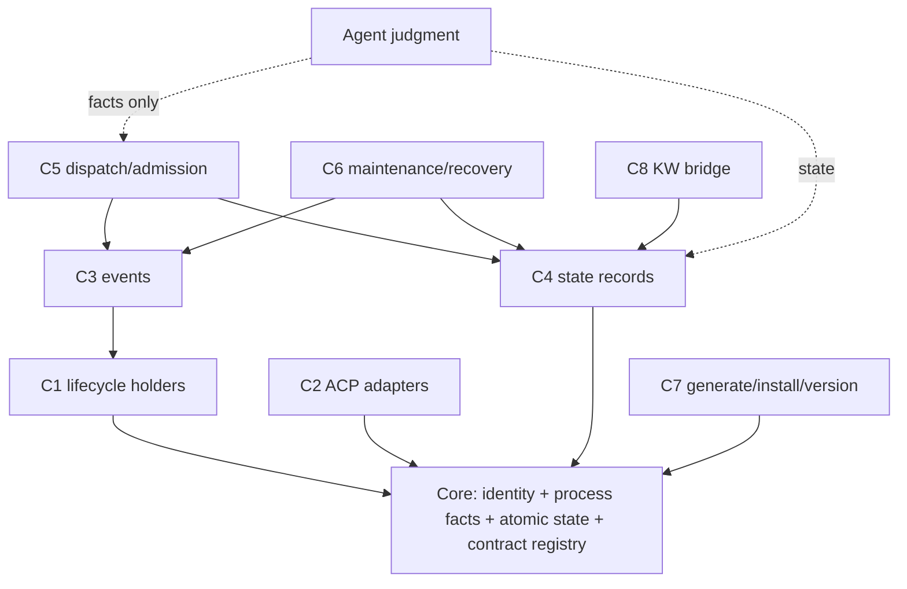

# KPR minimal core + components — formal design draft v1 (2026-10-07)

Status: DRAFT for root personal review + owner-appointed Fable convergence (one bounded round, authorized). Not a final plan; no implementation/installation authorized by this document. Research corpus: docs/research/ @97551c75; Fable final + AB addendum @c61383b2; root corrections applied in place.

## 1. Current state → target

Today: ten generated platform worker Skills (transport-only), one generated orchestrator Skill (`kaola-project-runner`), one external Delegator Skill, render+install pipeline (`render-skills.py`, `install-local.sh`), per-session ACP holders + optional launchd broker, typed state tool (`kaola-dispatch.py state`), KW lifecycle scripts as a sibling repo. Monoliths: `kaola-dispatch.py` (208 functions) and `kaola-acp-holder.py` (50 functions) each span at least five distinct responsibilities.

Target: a **minimal core** + replaceable components. **The B-line direction is ACCEPTED: a per-user/per-machine lightweight RESIDENT core (B0, lifecycle+events first) is the target runtime form.** In staging, the core begins as a shared library so the cut is provable and the pilot has something real to host; the library is the resident core's implementation, not an alternative to it. The design must state the resident core's own runtime responsibilities and its liveness/failure boundary with holders (§6a); it does NOT default back to no-daemon. Per owner: components are cut along ACTUAL source seams (measured below), not a predecided count; no per-function microservices; dependencies are explicit contracts; subtraction (remove/replace/retire/uninstall) is a first-class operation; KPR+KW remain optional modules sharing runtime norms without forcing synchronized consumer upgrades or a central credential store.

## 2. Core (irreducible, per measured source)

What must stay together because everything else depends on it and splitting it adds contracts without removing coupling:

- **Identity model**: platform/session/holder_instance_id/native-id/repo canonicalization (`canonical`, `normalize_id`, `worker_event_id`, `holder_of`, `assignment_identity`), plus the record-dir layout and schema names (`kaola-heartbeat-prompt/2`, `kaola-delegator-heartbeat/1`, `kaola-dispatch-index/1`). ~Small; zero I/O deps.
- **Process facts**: pid/liveness/spawn-time/argv anchor/process-tree groups (`process_alive`, `libproc_ps`, `process_table`, `child_groups`, `spawn_time_matches`, `holder_argv_anchor`, `holder_identity` in kaola-acp.py). NOTE (accuracy): these perform real I/O — /proc+sysctl reads, unix-socket probes with timeouts; they are I/O-*narrow* (local kernel + one socket), not I/O-free. Locks serialize access; **authorization of the single writer is a separate rule** (§6a lease), not implied by the lock.
- **Atomic state access**: `read_state_file`/`atomic_write`/`StateLock` + `kaola-record-contract.py` allowlists. Depends on identity only.
- **Contract registry (thin)**: schema names + key allowlists + version numbers consumed by both KPR and KW (closes the Python/JS dual-implementation divergence; generated validators, conformance suites optional per module).

## 3. Components (cut along measured seams)

Each row: current source (function clusters with line anchors). **The auditable, function-by-function assignment lives in `inventory-appendix.md`** (generated from source: 208+51+195+68 functions across the four scripts; every function assigned to exactly ONE component or listed UNASSIGNED-with-reason — UNASSIGNED must reach zero before P1). Duplicate-ownership errors in the v1 draft (e.g. `worker_event_id` listed under both core and C3) are resolved there by primary-responsibility rule. `main`/event-loop blocks are inventoried as their own rows, not omitted. Contract specifics per component (exact versions, data owner, test names, replace/uninstall steps) are the per-component contract documents P1 produces; §3 rows carry the seam rationale, not those details.

| # | Component | Current source (measured) | Why not core | Key interfaces / typed errors | Deps |
|---|---|---|---|---|---|
| C1 | Session/process lifecycle | kaola-acp-holder.py: parse_dispatcher/parse_heartbeat_host/read_heartbeat_file/start_epoch/live_spawn_entries/worker_tree_groups/dispatched_worker_groups/scrub/run_probe; kaola-acp.py start/stop/status/drain-restart/rebind-host | holder orchestration policy, not identity facts | receipts (`schema_version 3`, `stopped/exit/residual_pids`), `holder-lost`, `holder-not-ready` | core identity+process facts |
| C2 | ACP transport adapters | platforms/*.yaml, scripts/adapters/*.sh, kaola-zcode-acp.py / -opencode- / -dsh-, vendor claude-code-acp | per-platform variance; catalogs are data not logic | manifest fields, `acp_mode_config_id`, per-platform quirks docs | core identity |
| C3 | Events | kaola-acp-holder.py worker_event_id/attention_fingerprint; kaola-acp.py observe/capture/follow; events.jsonl rotations | consumers differ (Host UI vs state) | bounded capture receipts, `truncated` fields, cursor discipline | C1 |
| C4 | Current-state access | kaola-dispatch.py state CRUD (init/update/retire/view/check/migrate; 47-fn cluster incl. task/hold/alert/decision records) | record kinds evolve; core keeps only atomic access | StateRefusal codes (`conflict`, `retire-unmet`, `schema-unsupported`...), rev numbers | core atomic access |
| C5 | Dispatch/admission facts | kaola-dispatch.py execute/collect/project/delegator_seats (27-fn cluster; dispatch_links, seat_projection) | admission policy is Agent judgment over tool facts; the tool only records facts | plan schema, index schema, dispositions, `requirement-unmet`, `resource-conflict`, `shared-occupied` | C4, C3, core |
| C6 | Bounded maintenance/recovery | recovery-input/checkpoint; kaola-compact-recovery.py; kaola-project-compact-notice.py; sideagent binding+recipe | optional (absent → inputs simply queue) | recovery_input seq, checkpoint batches, `signal-unverified` | C4, C3 |
| C7 | Generation/install/versioning | render-skills.py, install-local.sh, budgets.json, accepted-revision pin, install-verify | pure build-time; absent at runtime | render receipts, budget check, pin gate, `kaola-project-runner-install-verify/1` | none (consumes core schemas) |
| C8 | KW engineering bridge | Kaola-Workflow repo (READ-ONLY design partner): claim/finalize/sink, chain receipts | separate ownership & artifact model already | workflow-state.md, ledger, `chain-receipt.json` codeTreeHash | C4 contract registry |

**Not components**: Agent judgment (planning/selection/acceptance) stays in Agents by definition; #267 escalation stays per-task inside C4/C5 facts.

## 4. Mermaid dependency DAG

No cycles; the core is the only shared substrate; C2 and C7 depend on nothing but the core (independently skippable at runtime/install time).

## 5. Optional install / runtime loading / subtraction

- Install-time selection exists TODAY as partial flags (`--no-orchestrator`, `--platform`, link|copy) — **a `--component` grammar with `requires`/`provides` manifests is a P2 CANDIDATE, not existing**.
- Runtime loading: **CANDIDATE pilot, not existing** — C6 (absent → recovery inputs must be DURABLY recorded by C4 with a typed `unsupported/queued` receipt and dedup on reload; who records and replays is C4's contract, to be specified in P3) and C8 (Workflow on-if-available). `holder_features` is capability ADVERTISEMENT for negotiation, not a loader; the actual load/activation mechanism is part of the P2/P3 design. Nothing here claims current behavior beyond what shipped in #271/#273/#274.
- **Subtraction**: every component defines (a) uninstall = remove generated payload + its config namespace; (b) retire = stop loading, keep data namespace readable via core contract registry; (c) replace = same provides-contract, swapped implementation, cross-component tests must pass unchanged; (d) data ownership stays with the consuming project (`.kaola/`), never moved into a component. Deleting a module must NOT force synchronized consumer edits: consumers depend on contracts (schemas + typed errors), and contract versions are additive-with-refuse (unknown version → refuse with named id — the proven #268/#273 style). **Retired-module data readability is NOT guaranteed by schema allowlists alone**: the core registry must ship per-kind reader fallbacks — read-only last-known-contract reader, else typed `unsupported-kind` with an export path — plus an explicit retention/migration choice at retire time (keep-readable / export-then-drop). That reader-fallback set is P2 contract-doc content, not current behavior.

## 6. Failure, fencing, upgrade semantics (design, all UNTESTED until staged)

- Single-writer per artifact stays (StateLock/atomic write). Cross-store fencing: any future shared store (B-line option) requires an explicit **handoff token** (lease with epoch) — **un-handed-off fallback dual-write is forbidden** (root constraint).
- Startup contention: last-writer detection by holder_instance_id epoch (already the exact-stop guard substrate); a newer holder supersedes, older refuses.
- Crash recovery: C1 holder exit does not lose C4 state (files+locks); C6 re-binds queued inputs; no auto-restart (Host-on-demand boundary unchanged).
- Version compat: contract registry versions; reader-older → typed refuse (never silent). Cross-version data migration staged per component with reader-before-writer rollout (Fable C6 fact: current validator already refuses unknown keys → fail-closed).
- idle-exit is a *candidate* policy for optional components only; it must not weaken the resident-service goal (owner A/B decision) nor the per-user/per-machine lightweight core direction (B0).

## 6a. Resident-core runtime responsibilities and holder boundary (B0)

The resident core (per-user/per-machine) owns: lifecycle supervision of component sessions it starts (C1 policy executes as a component the core hosts), event fan-out with per-subscriber cursors (C3 contracts), data access enforcement (C4 contracts), and module load/unload dispatch. It does NOT own: Agent judgment, prompts, acceptance, or any grant semantics (those remain in Agents + C4 records). **Holder liveness is independent of core liveness**: holders keep their sessions and single-writer rights if the core exits (fail-open for in-flight work, never killed); the core's own failure degrades new dispatch/event fan-out only, with a typed `core-unavailable` receipt and queued-input durability from C4. Restart of the core re-binds via lease handoff (§6 fencing) — never by killing holders. This boundary is DESIGN; every claim here is untested until P5 drills.

## 7. Cross-component test evidence (what proves a cut)

Each component ships its own suite plus one integration contract test per edge in the DAG (C1→CORE identity, C5→C4 dispositions, C6→C4 recovery seq...). A module suite passing alone never replaces cross-module migration/retirement proof (root constraint). Pilot candidates from current reality: #274 package-closure test (C7 proving C6's helper closure), #273 real-entry suites (CORE process facts through C1 CLI and C5 consumer).

## 8. Open decisions for root/Fable convergence

1. Core library language/packaging: single python package consumed by generated skills (recommend) vs multi-language contract generation.
2. C4/C5 boundary: whether seat_projection belongs in C5 facts or core (recommend C5; core stays free of grant semantics).
3. C8 contract-registry co-ownership with KW maintainers.
4. Whether C7 gains a `--component` install grammar now or after the pilot.
5. Staging order (see migration.md) and the B0 resident-core pilot scope (lifecycle+events first, per Fable AB).
